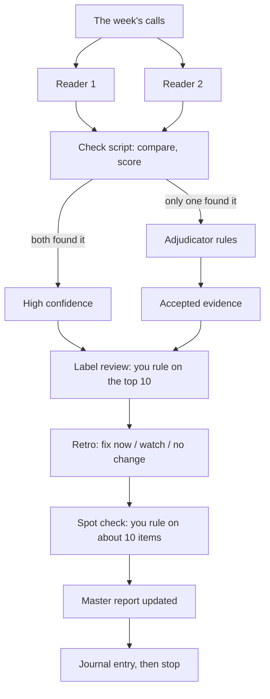

# How it works

This page explains the architecture, and then how it works **right now** in Victor's build, including what is manual and what is not. Read it once before you start. You do not need to memorise it. Claude Code will keep coming back to these ideas.

## The one idea behind the design

There are two kinds of work in this system:

- **Judgement**: reading a call and deciding whether a sentence carries one of your messages. This is done by **AI agents**: fresh copies of Claude, each given one written instruction file (a **spec**) and a short list of files it is allowed to read.
- **Counting, checking and drawing**: scoring, merging, comparing and charts. This is done by **small Python scripts**. They always give the same answer for the same input, so you can trust and rerun them.

> **Judgement goes to agents. Arithmetic goes to scripts.** An AI that is asked to count tends to count slightly differently each time.

## The pieces

### 1. Your inputs

| Input | What it is |
|---|---|
| **Assets** | Your enablement documents: decks, one pagers, blogs, playbooks, scripts, templates, webinars. Plain text or Markdown, with numbered sections or slides |
| **Asset register** | One row per asset *version*: release date, date it was replaced, owner, audience, buying stage, who uses it |
| **Asset sections** | Every section or slide in every asset, so a reader can cite "Deck 4, slide 22" |
| **Claims table** | The heart of it. Every distinct message in your assets, in short form, with a scope: **exclusive** (one asset carries it), **shared** (two or three), or **generic** (many) |
| **Claim links** | Which asset versions and sections carry each claim |
| **Message hierarchy** | Claims grouped into the messages and themes your team is trained on, anchored to your positioning document |
| **Calls** | Transcripts of sales and customer success calls, with date, speakers, timestamps and a buying stage per call |
| **Labels list** | A shared list of names for the gaps and customer signals the readers find, so they stop inventing a new name for the same thing each week |

Victor's fictional pack has 24 asset versions, 279 sections, 121 claims, 365 links, 39 messages, and 85 calls over eight weeks. Yours can start much smaller. See [03-prepare-your-inputs.md](03-prepare-your-inputs.md).

### 2. The readers (agents)

Two **reader** agents read each week of calls independently. They never see each other's output or any answer key. Each one gets the claims table and one spec. For every speaker turn they write one row per claim:

`file, time, speaker, claim_id, gap_label, event, fidelity, asset_id, version, section_id, confidence, reason`

- **event**: what happened. `used` (someone on your team says it), `shown`, `sent`, `mentioned`, `requested`, `missing` (an asset existed and should have been used), `buyer echo`, `buyer pushback`, `field born` (said before any asset carried it, or never carried), `rep built` (a rep made their own material), `lookalike` (sounds like yours, is not), `internal`.
- **fidelity**: how faithful it was. `verbatim`, `near verbatim`, `faithful paraphrase`, `drifted` (the meaning moved), `contradicted`.
- **reason**: one sentence quoting the words that decided it.

Readers also log **customer signals** in the same file: `goal`, `feature request`, `renewal question`, `churn mitigation`, `win back`, `renewal reason`, `feedback`, `constraint`, `value`, `enablement need`. See [specs/labels-and-signals.md](../specs/labels-and-signals.md).

### 3. The check (a script)

A script compares the two readers' files. Where **both** found a moment, confidence is **high**. Where **only one** did, the item goes to the adjudicator. It also scores recall against a small answer key if you have one.

### 4. The adjudicator (an agent)

A third, fresh agent reads **only** the items the two readers disagreed on, with a few turns of context either side, and rules: `accept`, `event only` (the asset is named but none of its content is said), `reject`, or `unsure`.

### 5. The humans (you, in short reviews)

| Review | Who | What |
|---|---|---|
| **Label review** | You | A script lists every gap and signal label and ranks the ten most uncertain. You keep, merge, rename or drop each. |
| **Spot check** | You | About ten adjudicated items, led by anything marked unsure. You agree or rule. |
| **Retro** | Claude, then you | Claude groups the week's errors by cause and tags each one `fix now`, `watch` (needs one or two more weeks of data) or `no change`. You approve the fixes. |

### 6. The report (written once, updated each week)

One master report for the person who owns messaging: a first screen of three findings with confidence tiers, then vehicles by buying stage, what is landing, what the field says that the documents lack, what is not landing and why, what customers are telling you, and a table of fixes with an owner. Two visuals: assets by buying stage, and a week over week heat map. See [specs/report-spec.md](../specs/report-spec.md).

## The weekly loop

Plain text version: calls, then two readers, then a check script, then an adjudicator for the disagreements, then your label review, retro and spot check, then the report is updated, then a journal entry, then it stops and waits for you.

## One sentence, all the way through

In a discovery call, an account executive promises the customer a corporate footprint plus six product footprints **in three to four weeks**. The pitch deck says four to six.

1. **Reader 1** logs that turn: claim "time and effort to the first numbers", `used`, `drifted`, pitch deck slide 22, confidence high.
2. **Reader 2**, independently, logs the same turn and claim, but grades it `contradicted`.
3. The **check** finds both readers on the same turn and claim, so it is **high confidence** and needs no adjudicator.
4. The fidelity disagreement (drifted against contradicted) shows up in the **retro**: the spec never said *which version* to grade against. The spec gets a one line fix.
5. In the **report** it becomes evidence for a finding: "Reps compress the start, and the documents disagree with each other", and for a fix: one answer on time and effort across all documents.

That path explains most of the design: independent readings, agreement as confidence, a script that checks, a human who rules on the uncertain ones, and a retro that turns disagreements into better instructions.

## How we measure, and why numbers are treated carefully

- **The answer key** (Victor's fictional data only): a list of moments where a claim *should* be found. Agents never read it. It is a **floor, not the truth**: readers found real moments the key did not list, so use it for recall ("did it miss things?"), not blindly for precision.
- **Recall**: the share of the key's moments a reader found. On the fictional data it ranged from **81% to 96% by week** at call level, depending on week and settings.
- **Reader agreement**: how often the two readers find the same pairs. A drop is a warning light.
- **Fresh agents**: readers and the adjudicator are always fresh agents that read only the allowed folder. That stops the agent that built the data from marking its own homework.
- **Guardrails**: a minimum recall on the claims that are easiest to measure (exclusive and shared). If it falls below the floor, move up an effort level or tighten the spec.

**You will not have an answer key.** The kit tells you how to build a small one by hand (10 to 20 moments you are certain about). It is the best way to see whether the agent is working for *your* data.

## The open source tools

All of these run on your own machine. They are optional at the size most teams start at, and Victor's tests showed that **letting Claude read the whole call beat a pipeline that searches first and then judges**. They become worth it at hundreds of calls a week.

| Tool | What it does in plain language | How it is used here |
|---|---|---|
| **uv** and a **virtual environment** (`.venv`) | uv installs Python packages. A virtual environment is a sealed box inside the project folder, so nothing touches the Mac's own Python | Sets up the project's Python once |
| **RapidFuzz** | Measures how close two pieces of text are, allowing typos and small changes | Checks that every quote an agent returns really appears in the transcript |
| **bm25s** | Keyword search that weights rare words more | Optional shortlist, and finding lookalikes |
| **fastembed** with a **multilingual E5** model | Turns a sentence into numbers so sentences with similar meaning sit close together, even with different words | Optional shortlist; suggests which section of an asset carries a claim |
| Rerankers, MiniCheck, BERTopic | More careful matching, fact checking and topic grouping | **Not used.** They were tested or considered and were not needed at this size |

Two findings from the tests worth knowing:

1. **Similarity finds the topic, not agreement.** A pushback scored higher than a faithful paraphrase in one test. Search can make a shortlist, but it cannot tell a deck's old version from its new one. That job needs exclusive wording and release dates.
2. **At this size, reading beats searching.** Claude reading whole calls found about 95% of the planted moments, against about 87% for a search shortlist followed by a judge. Every miss in the shortlist run was a moment the right claim never reached the shortlist, and those misses turned into false "gaps".

### Words you will hear around these tools

- **Embedding, vector, cosine similarity:** the "map" of sentences above. Cosine similarity is the closeness score, from 0 to 1.
- **PyTorch and ONNX:** PyTorch is the big library most AI models run on. ONNX is a lighter format that runs models without it. fastembed uses ONNX. This matters on older machines: an older Intel Mac cannot run current PyTorch, which was a main reason to pick fastembed.
- **Model weights and licences:** open weights models are free to download, but some have licence terms for commercial use. One fact checking model used for a test needs a licence for commercial use, which was one more reason it was not used.
- **Where the models come from:** the embedding model is downloaded once from the internet, and then runs on your machine.

### Why a funnel, and why it was not needed

Matching what someone *said* to what a document *says* is three questions: is it the same topic, is it the same claim or the opposite, and which asset carries it. The research field closest to this is claim retrieval from fact checking. Typical systems use a funnel: cheap search makes a shortlist, a careful model reranks it, and sometimes a model verifies. Victor tested that funnel. At about a dozen calls a week, letting Claude read the whole call with the claims table beat it. At hundreds of calls a week the shortlist becomes worth it to cut cost.

Nothing open source does this exact job. The closest projects score reps against sales frameworks, not against a company's own documents, and commercial conversation tools track messages you define in advance and train one by one.

## How it works right now (honest status)

- **Run so far:** 3 of 8 planned weeks on the fictional data (weeks 33, 34 and 37). Every other week still to run.
- **What is automated:** the check scripts, the label review, the scoring, the asset use table and the two visuals are Python scripts. Readers and the adjudicator are Claude agents started with a spec.
- **What is manual:** deciding the claims table, running each step in order, label review, retro, spot check, and writing the report text. Claude drafts, Victor reviews and rules.
- **What is not built yet:** a claims *proposal* loop (the agent proposing claims when an asset ships), and a packaged one command agent. This kit is the specs and the process you use to build your own.
- **Models:** built with Opus 5.5 (high, then medium). Victor is now testing Sonnet 5.5 at medium effort. The first Sonnet results will be added to the repo.

## Your turn

Before the next page, write down, in your own words:

1. Which two or three messages is your team supposed to say on every call?
2. Where do you suspect reps say something different from your documents?
3. What would you do differently on Monday if you knew the answer?

These three answers become the opening of your **company brief** in [03-prepare-your-inputs.md](03-prepare-your-inputs.md).
